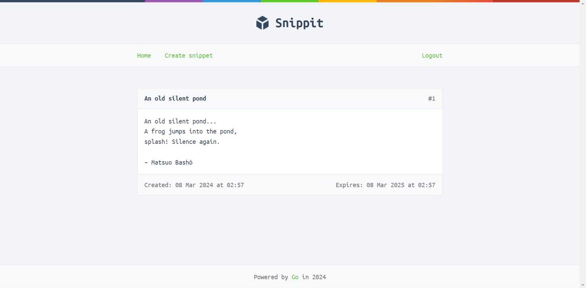

# Snippit

Snippit is a web app that lets people paste and share snippets of text — similar to Pastebin or GitHub’s Gists. Created from reading [Let's Go!](https://lets-go.alexedwards.net/) by Alex Edwards.

### How to run:
1. Run `docker compose up`
2. Open adminer at http://localhost:8080
3. Login with system=mysql, server=db, user=root, pass=root, db=snippit
4. Open SQL command on the left and run the queries in query.sql
5. Run `go run ./cmd/web`
6. Open http://localhost:4000

### Features:
- MySQL database
- Routing with julienschmidt/httprouter
- User authentication
- Dynamic templates with Go's html/template package
- Session manager using alexedwards/scs
- Unit tests

